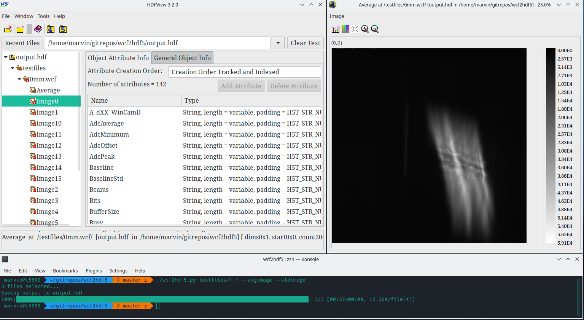

# wcf2hdf5

Wcf2hdf5 converts .wcf files from DataRay beam profiling cameras to the hdf5 format.



## Usage

```bash
$> ./wcf2hdf5.py --help
usage: wcf2hdf5.py [OPTION] [files]...

Converts .wcf files from DataRay beam profiling cameras to the hdf5 format.

positional arguments:
  files

options:
  -h, --help            show this help message and exit
  -v, --version         show program's version number and exit
  -o OUTPUTFILE, --outputfile OUTPUTFILE
  -a, --avgimage, --no-avgimage
                        Calculates the averages of all images in a file (default: True)
  -s, --stdimage, --no-stdimage
                        Calculates the std's of all images in a file (default: True)
```

## Setup

Install Python>=3.8 and pip3 on your system, then run `pip3 install -r requirements.txt`

## Requirements

The software has been tested with the following dependencies

```
h5py==3.7.0
numpy==1.23.5
tqdm==4.64.1
```


